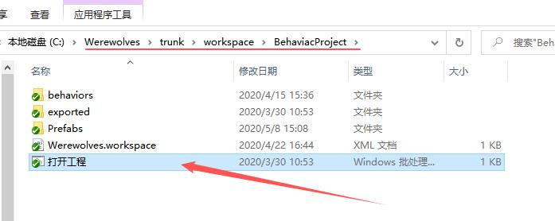
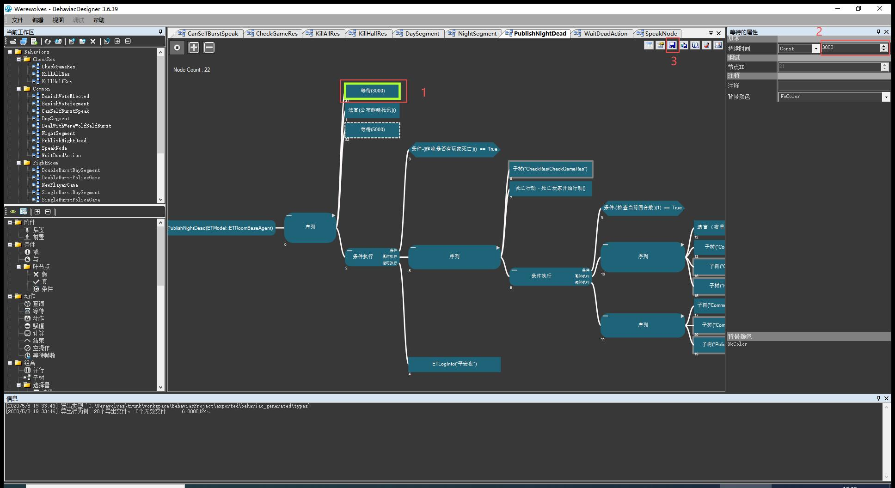
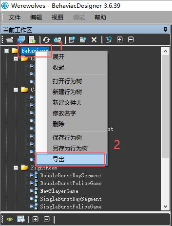
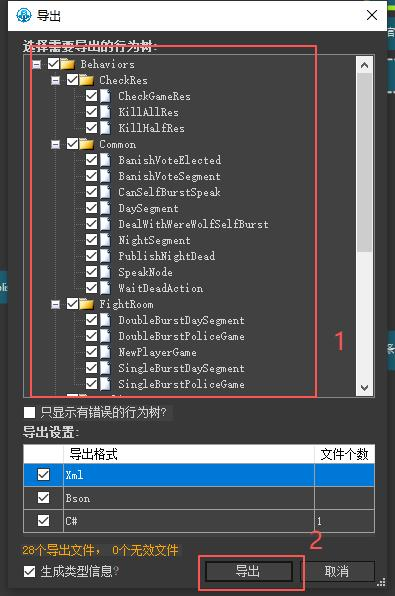
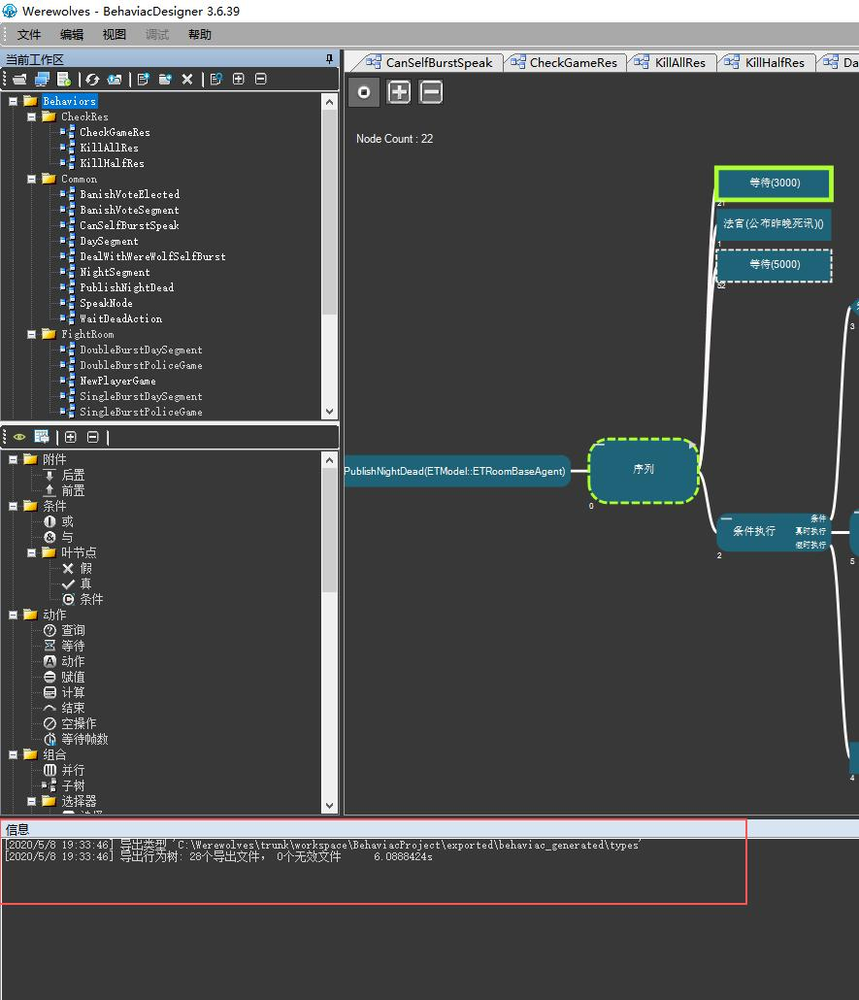

# BehaviacProject行为树操作指南
# 一、运行路径
**打开路径：**Werewolves\trunk\workspace\BehaviacProject

如图双击打开工程软件

# 二、编辑
1.选择一个需要编辑的行为。2.在右侧属性里面编辑。3.**点击保存！**

# 三、检查与导出
1.**点击总文件**，右键单击选择“导出”。

2.**确保选中所有文件！**然后点击“导出”。

3.检查工程有没有提示报错，有无效文件则需正确编辑，**无效文件不可以上传！！！**

4.没有无效文件就可以在svn里上传了